# Quora Question pair similarity

## Motivation

Quora is a place to gain and share knowledge about anything. It’s a platform to ask questions and connect with people who contribute unique insights and quality answers.
Every month tons of questions are added on Quora and multiple questions with the same intent can cause seekers to spend more time finding the best answer, and make writers feel they need to answer multiple versions of the same question.

⚪Task: 
 
1. In this case study we have to identify whether a "pair of questions" is duplicate or not.
2. The duplicate questions asked can be removed so that the user can find the best answer already available.
3. This is a binary classification problem and the metric used here is "Log-loss".
4. I have used multiple models to come up with better predictions but "Xgboost" stands out as the best one with the minimum log-loss among the other two models used (Logistic regression, Random forest).

## Acknowledgements

 - [Data Source](https://www.kaggle.com/c/quora-question-pairs)
 - [Fuzzywuzzy Library](https://www.geeksforgeeks.org/fuzzywuzzy-python-library/)
 - [How to form Wordcloud](https://www.geeksforgeeks.org/generating-word-cloud-python/)
 - [Training on XgBoost](https://xgboost.readthedocs.io/en/stable/python/python_intro.html)

## Data Overview

The dataset contains question id's, question pairs and the target variable where
(0) = Not a duplicate pair, (1) = A duplicate pair of question. 

This is a imbalanced dataset problem as we can see below:

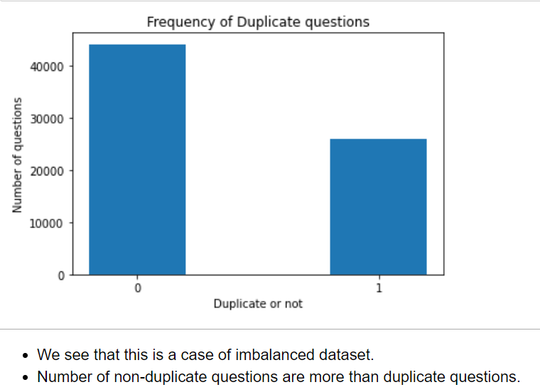

Below is a snapshot of the data looks initially:

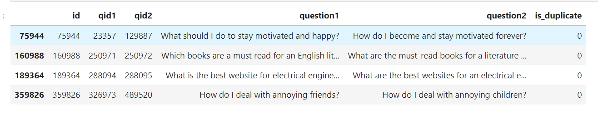

Following are the examples of duplicate and non duplicate pairs of questions:

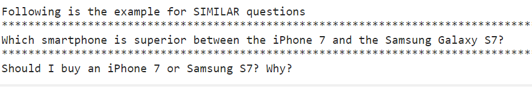

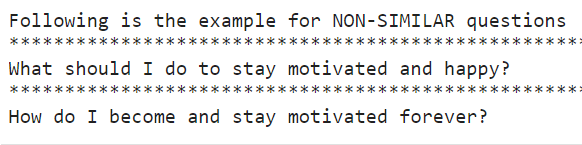

Although there are a small segment of questions which have been repeated and we also get the unique number of questions asked through the (question id)

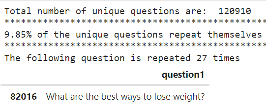

## Feature Extractions

We have two stages for feature extraction, the first stage involves extracting "basic features" and the latter stage consists of "advanced features".

1. Basic feature contains the following:

- Length of sentence (number of words in a question)
- Common words between a pair of questions.
- Word_share: (common_word_count/total number of words)
- cwc_min & cwc_max: (Ratio of common_word_count to min & max length of word count of Q1 and Q2)
- Whether "first" word of pair of question is equal (1) or not (0).
- Whether "last" word of pair of question is equal (1) or not (0).
- Difference of number of words in question pair.
- Average number of words in a question pair.

We add the above features to the datasetnow: 

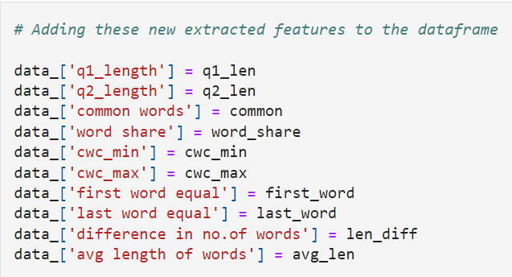

2. Advanced features (fuzzywuzzy library)

[Click here to know fuzzywuzzy library](https://www.geeksforgeeks.org/fuzzywuzzy-python-library/)

- Longest substring ratio 
(length of longest common substring)/(min (length of question 1, length of question 2))

- Partial ratio.
- Token sort ratio.
- Token set ratio.
- Wratio.

We add these advanced features to the dataset:

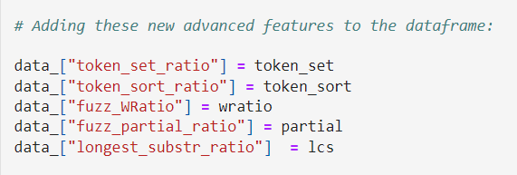

## Data Visualisation

1. Pair plots for advanced features:

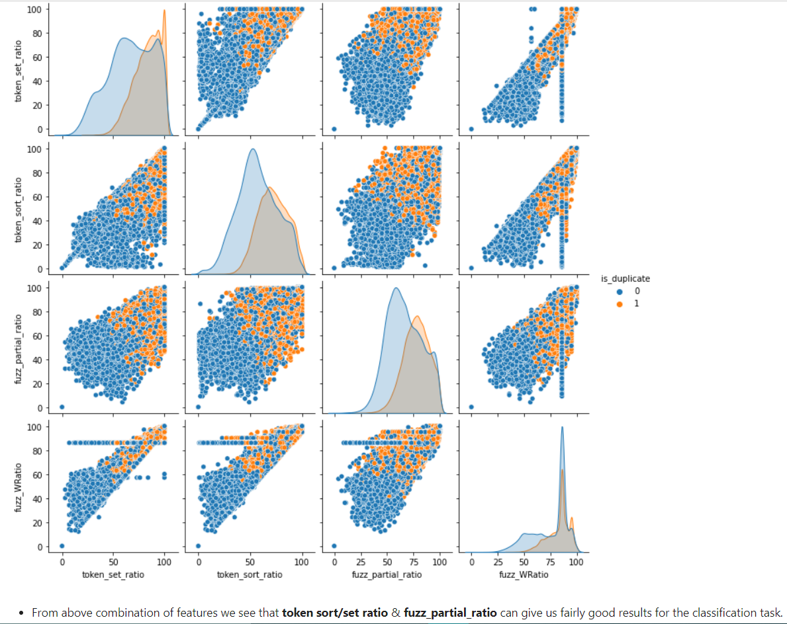

2. Wordcloud for duplicate pairs:
This tells us which words contribute for a question pair to be termed as "duplicate".

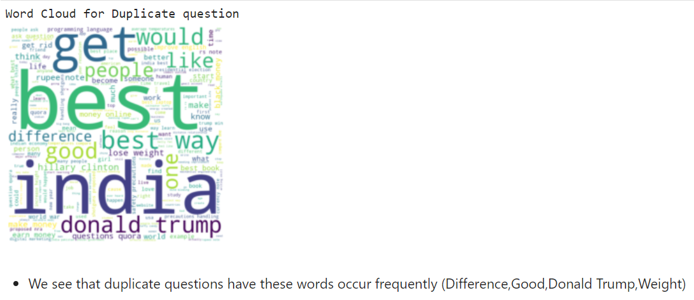

3. Wordcloud for non duplicate pairs:
The below words are the most occuring in a "non duplicate" question pair.

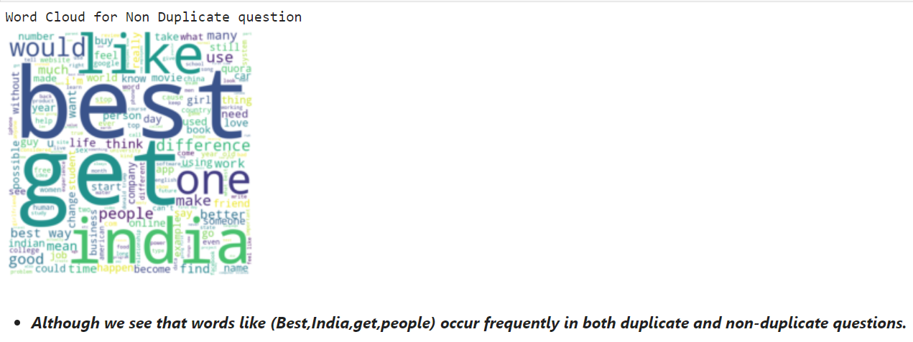

4. How well (Wratio, partial ratio) feature identifies duplicate pairs.

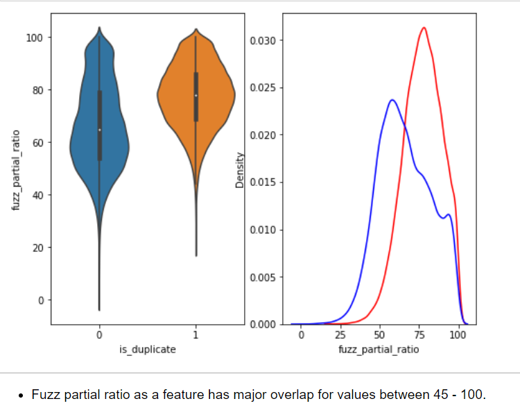

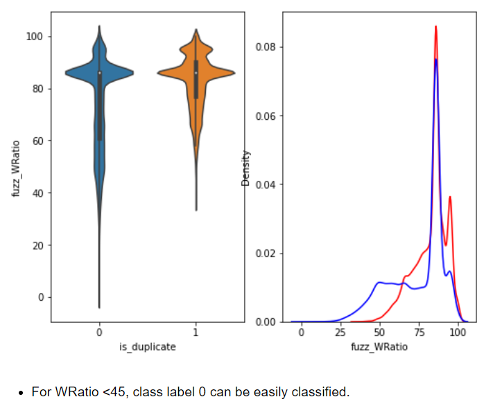

## Data Cleaning

⚪Missing Values: 

Since this is a text data problem there are no serious effects of missing values, but we found one question with (NaN) value and have replaced it with an empty string.

⚪Cleaning Text data:

- Removing Stopwords, punctuations, numeric values.
- We remove certain words from the list of "stopwords" to preserve the meaning of title.
- Contracted words are expanded (won't ---> will not)
- Lemmatization is used to return the dictionary form of words.

## Data preprocessing
   
We are using TF-IDF Word2Vec for converting sentences into vectors, it involves following steps:

- Apply TF-IDF vectorization on clean data.
- Get the IDF values for each feature (max feature = 1000).
- Create a list of words from the entire corpus.
- Form W2V for each of these words (size = 200), this means that each word is represented by a 200 dimensional vector.

Below we can see how this W2V is created for every word.

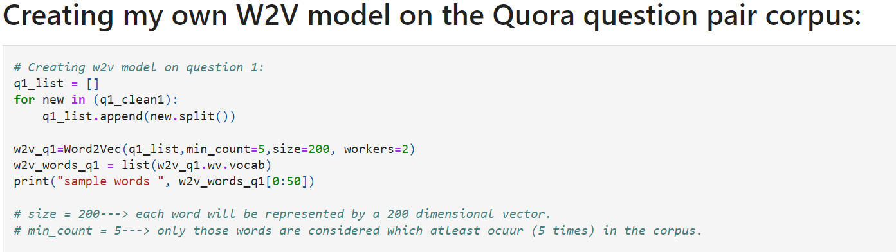

- TF-IDF W2V by multiply each TF-IDF value with the W2V for a given word, then adding these vectors formed and finally dividing the result by sum of TF-IDF values.

         TF-IDF W2V = Σ {[TFIDF(Wi) * W2V(Wi)]/TFIDF(Wi)}
         Wi = Any given word.

We can see the code snippet for this below:

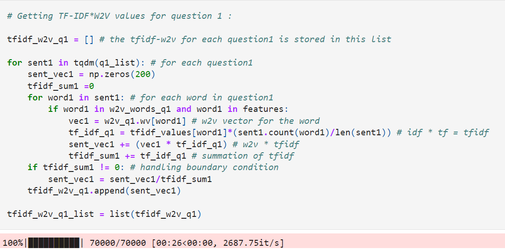

   

## Models

After data cleaning and preprocessing we add all the features to our dataset and the new dataframe now looks like:

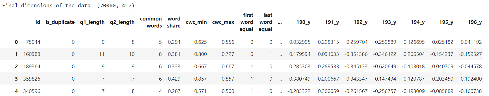

⚪ Random Model:

- We build this model to get the idea of log-loss value that we have to beat.
- The log-loss obtained here is the worst one as this model predicts the class label (0) or  (1) with probability of 0.5.
- The log-loss value we got was = 0.8904

⚪ Logistic Regression:

- We use the SGDClassifier with alpha values ranging from (10^-5 to 10^1).
- On top of this model we apply calibration to get better probability values for using in the log-loss metric.   
- We find out the best alpha to be (0.01), then we fit the entire train data with this parameter and determine the log-loss on both train and test datasets to check if we are overfitting.

⚪ Random Forest:

- We perform hyperparameter tuning through RandomizedSearchCV to obtain best parameters to fit the data
- Fine tuning of the obtained best parameters is done to avoid overfitting to the training data.
- These are the parameters used for training random forest (n_estimators = 15, criterion = 'entropy', max_depth = 5)

⚪ XGboost:

Below we see the training of XGBoost model:

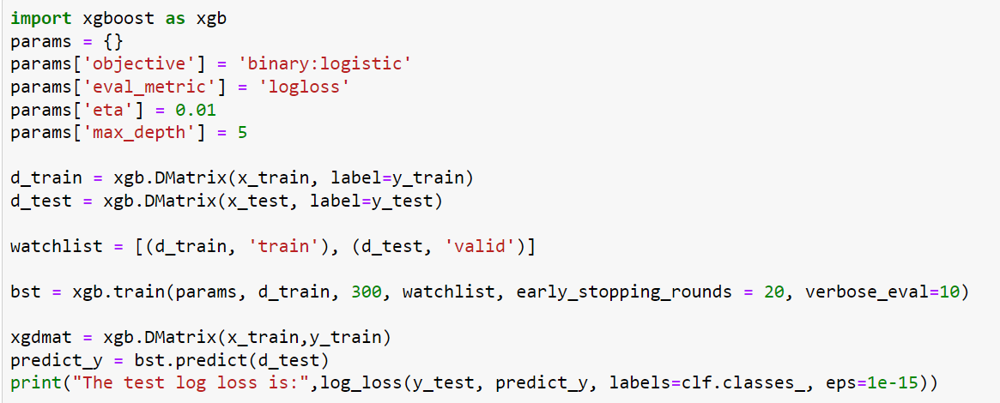

**( We get best results with XGBoost!! )** 

## Results

The following table shows log-loss values obained with different models.

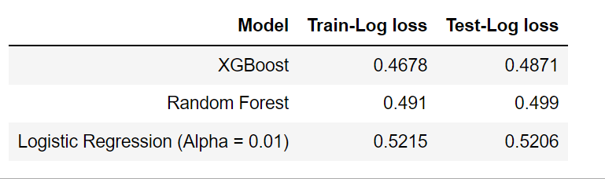